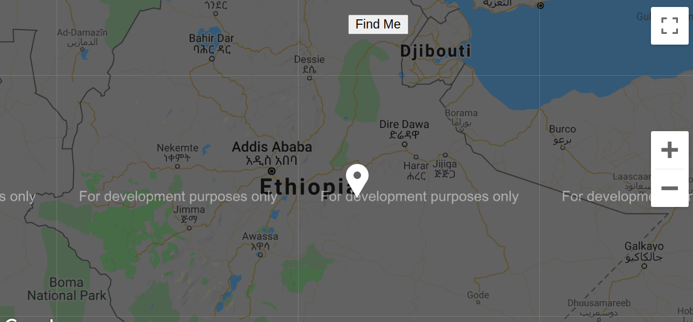

# Students Finder UI 
This is a front-end UI app for pickmeup application which locates current location of users by making use of react-google-map API.

## Getting Started
This project was bootstrapped with [Create React App](https://github.com/facebook/create-react-app).
To get a local copy up and running, please follow the below steps. 

### Prerequisites

- Node.JS
- React

### SetUp 
- Clone the repository 
`git clone git@github.com:henatan99/pickmeup-UI.git`

- cd to the project directory 
`cd pickmeup-ui`

- checkout to current branch 
`git checkout find-me-google-map`

- Install dependancies 
`npm install`

- And follow the App Usage instructions in the next section

### `npm start`

Runs the app in the development mode.\
Open [http://localhost:3000](http://localhost:3000) to view it in the browser.

The page will reload if you make edits.\
You will also see any lint errors in the console.

### `npm test`

Launches the test runner in the interactive watch mode.\
See the section about [running tests](https://facebook.github.io/create-react-app/docs/running-tests) for more information.

### `yarn build`

Builds the app for production to the `build` folder.\
It correctly bundles React in production mode and optimizes the build for the best performance.

### Usage
The provided API for Geocode functionality is not working due to billing issue. You can input your own apiKey by settine the apiKey in `src/helpers/geo_code` file.
 
Run the app in local server after setting it up. Then, enjoy the ride. 

## Authors

👤 **Henok Mossissa**

- GitHub: [@henatan99](https://github.com/henatan99)
- Twitter: [@henatan99](https://twitter.com/henatan99)
- LinkedIn: [Henok Mossissa](https://www.linkedin.com/in/henok-mekonnen-2a251613/)

## :handshake: Contributing

Contributions, issues, and feature requests are welcome!

## Show your support

Give a :star:️ if you like this project!

## Acknowledgment 

- Facebook team who created creat-react-app API
- [Google fonts](https://fonts.google.com/specimen/Raleway)
- [hatchways API](https://api.hatchways.io/assessment/students) 

## :memo: License

This project is [MIT](./LICENSE) licensed.